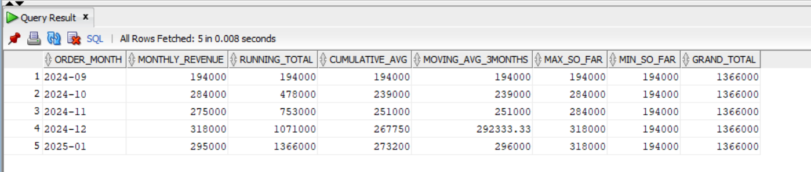
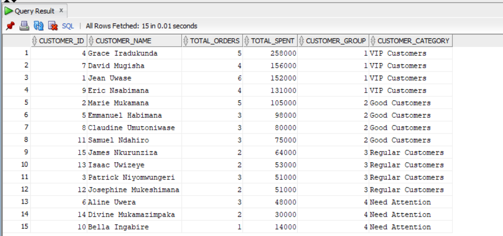
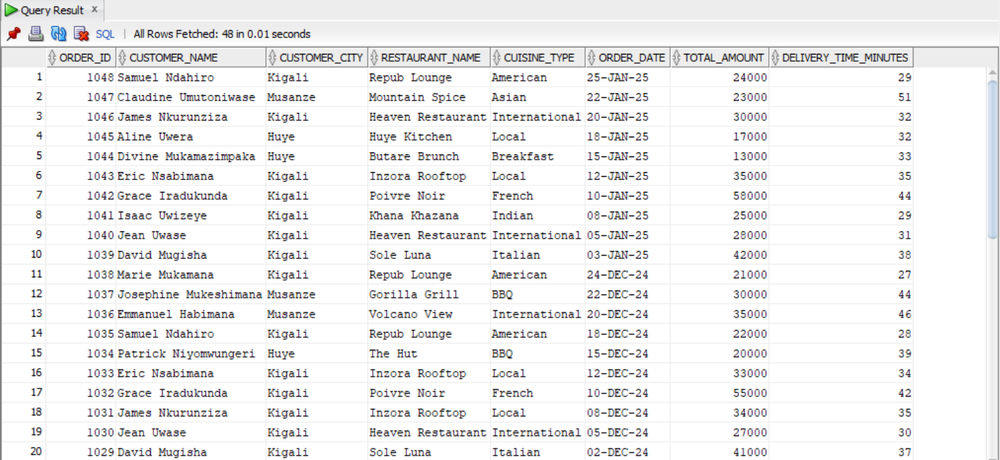

# QuickBite Food Delivery Platform - SQL Analysis Project

Course: Database Development with PL/SQL (INSY 8311)  
Institution: Adventist University of Central Africa (AUCA)  
Instructor: Eric Maniraguha  
Student: Rwema Ntibagwe Micah  
Student ID: 28433  
Group: A 
Submission Date: February 08, 2026

---

📋 Table of Contents
- [Business Problem](#business-problem)
- [Database Schema](#database-schema)
- [SQL JOINs Implementation](#sql-joins-implementation)
- [Window Functions Implementation](#window-functions-implementation)
- [Key Insights & Analysis](#key-insights--analysis)
- [References](#references)
- [Academic Integrity Statement](#academic-integrity-statement)

---

🎯 Business Problem

Business Context
QuickBite is a food delivery platform operating across multiple cities in Rwanda (Kigali, Huye, Musanze). The company connects customers with local restaurants and manages delivery operations across the region.

Data Challenge
QuickBite management struggles to identify which restaurants perform best in each city, understand customer ordering patterns, and track revenue trends over time. They need insights into peak ordering times, customer loyalty segments, and month-over-month growth to make data-driven decisions about marketing campaigns, restaurant partnerships, and delivery resource allocation.

Expected Outcome
Generate actionable insights on:
- Top-performing restaurants by region
- Customer segmentation for targeted promotions
- Revenue trends and growth analysis
- Customer retention and churn risk identification

---
🗄️ Database Schema

Entity Relationship Diagram

[ER Diagram](screenshots/schema/er_diagram.png)

Tables

1. Customers Table
Stores customer information and registration data.

| Column | Data Type | Description |
|--------|-----------|-------------|
| customer_id | NUMBER (PK) | Unique customer identifier |
| first_name | VARCHAR2(50) | Customer first name |
| last_name | VARCHAR2(50) | Customer last name |
| email | VARCHAR2(100) | Customer email (unique) |
| phone | VARCHAR2(20) | Contact phone number |
| city | VARCHAR2(50) | Customer city location |
| registration_date | DATE | Date customer registered |

 2. Restaurants Table
Contains restaurant details and ratings.

| Column | Data Type | Description |
|--------|-----------|-------------|
| restaurant_id | NUMBER (PK) | Unique restaurant identifier |
| restaurant_name | VARCHAR2(100) | Restaurant name |
| cuisine_type | VARCHAR2(50) | Type of cuisine offered |
| city | VARCHAR2(50) | Restaurant city location |
| rating | NUMBER(2,1) | Restaurant rating (0.0-5.0) |
| registration_date | DATE | Date restaurant joined platform |

3. Orders Table
Records all order transactions.

| Column | Data Type | Description |
|--------|-----------|-------------|
| order_id | NUMBER (PK) | Unique order identifier |
| customer_id | NUMBER (FK) | References Customers table |
| restaurant_id | NUMBER (FK) | References Restaurants table |
| order_date | DATE | Date order was placed |
| total_amount | NUMBER(10,2) | Order amount in RWF |
| order_status | VARCHAR2(20) | completed, cancelled, or pending |
| delivery_time_minutes | NUMBER | Time taken for delivery |

Relationships
- One Customer can place many Orders (1:M)
- One Restaurant can receive many Orders (1:M)
- Orders connect Customers and Restaurants (junction/transaction table)

Sample Data
- **15 Customers** across 3 cities
- **12 Restaurants** with varied cuisines
- **51 Orders** spanning September 2024 to January 2025

---

 🔗 SQL JOINs Implementation

### 1. INNER JOIN
**Purpose:** Retrieve all completed orders with customer and restaurant details

**Business Use:** View successful transactions to analyze purchasing patterns and track order performance.

```sql
SELECT 
    o.order_id,
    c.first_name || ' ' || c.last_name AS customer_name,
    c.city AS customer_city,
    r.restaurant_name,
    r.cuisine_type,
    o.order_date,
    o.total_amount,
    o.delivery_time_minutes
FROM Orders o
INNER JOIN Customers c ON o.customer_id = c.customer_id
INNER JOIN Restaurants r ON o.restaurant_id = r.restaurant_id
WHERE o.order_status = 'completed'
ORDER BY o.order_date DESC;
``` 


**Interpretation:**  
This query returns only successful orders where we have complete information about both the customer and restaurant. It helps identify active business relationships and transaction patterns.

---

### 2. LEFT JOIN
**Purpose:** Find customers who have NEVER placed an order

**Business Use:** Identify inactive customers for re-engagement campaigns.

```sql
SELECT 
    c.customer_id,
    c.first_name || ' ' || c.last_name AS customer_name,
    COUNT(o.order_id) AS Orders
FROM Customers c LEFT JOIN Orders o ON c.customer_id = o.customer_id 
GROUP BY c.customer_id, c.first_name || ' ' || c.last_name
HAVING COUNT(o.order_id) = 0;
```


**Interpretation:**  
Customers who registered but never ordered represent a lost opportunity. Marketing can target these users with welcome promotions or special discounts to activate them.

---

### 3. RIGHT JOIN
**Purpose:** Find restaurants with NO orders (no sales activity)

**Business Use:** Identify underperforming restaurants that may need support or removal from the platform.

```sql
SELECT 
    r.restaurant_id,
    r.restaurant_name,
    COUNT(o.order_id) AS Orders
FROM Orders o RIGHT JOIN Restaurants r ON o.restaurant_id = r.restaurant_id group by r.restaurant_id, r.restaurant_name 
HAVING COUNT(o.order_id) = 0; 
```

**Interpretation:**  
Restaurants with zero orders indicate potential issues such as poor visibility, bad ratings, or unpopular cuisine. Management can either provide marketing support or remove them from the platform.

---

### 4. FULL OUTER JOIN
**Purpose:** Complete view of all customers and orders, including unmatched records

**Business Use:** Data quality audit to find orphaned records or database integrity issues.

```sql
SELECT 
    c.customer_id,
    c.first_name ||' '|| c.last_name AS CUST_NAMES,
    r.restaurant_id,
    r.restaurant_name,
    o.order_id
FROM Customers c 
FULL OUTER JOIN Orders o ON c.customer_id = o.customer_id
FULL OUTER JOIN Restaurants r ON o.restaurant_id = r.restaurant_id
ORDER BY customer_id;
```

**Interpretation:**  
This audit query reveals data quality issues. Orphaned orders (orders without customers) indicate referential integrity problems that need immediate attention.

---

### 5. SELF JOIN
**Purpose:** Find customers from the same city who ordered on the same day

**Business Use:** Identify location-based ordering patterns for delivery route optimization.

```sql
SELECT 
    c1.customer_id AS customer1_id,
    c1.first_name || ' ' || c1.last_name AS customer1_name,
    c2.customer_id AS customer2_id,
    c2.first_name || ' ' || c2.last_name AS customer2_name,
    c1.city,
    o1.order_date,
    o1.order_id AS order1_id,
    o2.order_id AS order2_id,
    r1.restaurant_name AS restaurant1,
    r2.restaurant_name AS restaurant2
FROM Orders o1
JOIN Customers c1 ON o1.customer_id = c1.customer_id
JOIN Restaurants r1 ON o1.restaurant_id = r1.restaurant_id
JOIN Orders o2 ON o1.order_date = o2.order_date AND o1.order_id < o2.order_id
JOIN Customers c2 ON o2.customer_id = c2.customer_id
JOIN Restaurants r2 ON o2.restaurant_id = r2.restaurant_id
WHERE c1.city = c2.city
ORDER BY o1.order_date DESC, c1.city;
```

**Interpretation:**  
Clustering of orders by location and time enables delivery batching for efficiency. Multiple orders in the same city on the same day can share delivery routes, reducing costs and improving delivery times.

---

## 📊 Window Functions Implementation

### Category 1: Ranking Functions

#### ROW_NUMBER(), RANK(), DENSE_RANK(), PERCENT_RANK()

**Query:** Rank customers by total spending

```sql
SELECT 
    customer_id,
    first_name || ' ' || last_name AS customer_name,
    city,
    total_spent,
    ROW_NUMBER() OVER (ORDER BY total_spent DESC) AS row_num,
    RANK() OVER (ORDER BY total_spent DESC) AS rank,
    DENSE_RANK() OVER (ORDER BY total_spent DESC) AS dense_rank,
    ROUND(PERCENT_RANK() OVER (ORDER BY total_spent DESC) * 100, 2) AS percent_rank
FROM (
    SELECT 
        c.customer_id,
        c.first_name,
        c.last_name,
        c.city,
        NVL(SUM(o.total_amount), 0) AS total_spent
    FROM Customers c
    LEFT JOIN Orders o ON c.customer_id = o.customer_id
    WHERE o.order_status = 'completed' OR o.order_status IS NULL
    GROUP BY c.customer_id, c.first_name, c.last_name, c.city
)
ORDER BY total_spent DESC;
```

**Result Screenshot:**  


**Interpretation:**  
- ROW_NUMBER gives unique sequential numbers even for ties
- RANK shares rank for ties but skips next numbers (1,2,2,4)
- DENSE_RANK shares rank but doesn't skip (1,2,2,3)

This identifies VIP customers who deserve premium treatment and exclusive offers.

---

### Category 2: Aggregate Window Functions

#### SUM(), AVG() with ROWS and RANGE frames

**Query:** Running total of monthly revenue

```sql
SELECT 
    TO_CHAR(order_date, 'YYYY-MM') AS order_month,
    SUM(total_amount) AS monthly_revenue,
    
    -- Running Total (adds up from September to current month)
    SUM(SUM(total_amount)) OVER (
        ORDER BY TO_CHAR(order_date, 'YYYY-MM')
        ROWS BETWEEN UNBOUNDED PRECEDING AND CURRENT ROW
    ) AS running_total,
    
    -- Cumulative Average (average from start to current month)
    ROUND(AVG(SUM(total_amount)) OVER (
        ORDER BY TO_CHAR(order_date, 'YYYY-MM')
        ROWS BETWEEN UNBOUNDED PRECEDING AND CURRENT ROW
    ), 2) AS cumulative_avg,
    
    -- 3-Month Moving Average (current + 2 months before)
    ROUND(AVG(SUM(total_amount)) OVER (
        ORDER BY TO_CHAR(order_date, 'YYYY-MM')
        ROWS BETWEEN 2 PRECEDING AND CURRENT ROW
    ), 2) AS moving_avg_3months,
    
    -- Maximum Revenue So Far
    MAX(SUM(total_amount)) OVER (
        ORDER BY TO_CHAR(order_date, 'YYYY-MM')
        ROWS BETWEEN UNBOUNDED PRECEDING AND CURRENT ROW
    ) AS max_so_far,
    
    -- Minimum Revenue So Far
    MIN(SUM(total_amount)) OVER (
        ORDER BY TO_CHAR(order_date, 'YYYY-MM')
        ROWS BETWEEN UNBOUNDED PRECEDING AND CURRENT ROW
    ) AS min_so_far,
    
    -- Grand Total (all months combined, shown on every row)
    SUM(SUM(total_amount)) OVER () AS grand_total

FROM Orders
WHERE order_status = 'completed'
GROUP BY TO_CHAR(order_date, 'YYYY-MM')
ORDER BY order_month;```

**Result Screenshot:**  


**Interpretation:**  
Running totals show cumulative revenue growth over time. The 3-month moving average smooths out monthly fluctuations to reveal underlying trends. Rising moving averages indicate business growth; falling averages signal need for intervention.

---

### Category 3: Navigation Functions

#### LAG(), LEAD()

**Query:** Month-over-month revenue growth

```sql
SELECT 
    c.first_name || ' ' || c.last_name AS customer_name,
    o.order_date AS current_order_date,
    o.total_amount AS current_order_amount,
    -- Shows when this customer ordered BEFORE this order
    LAG(o.order_date) OVER (PARTITION BY c.customer_id ORDER BY o.order_date) AS previous_order_date,
    -- How many days between orders?
    o.order_date - LAG(o.order_date) OVER (PARTITION BY c.customer_id ORDER BY o.order_date) AS days_between_orders
FROM Orders o
JOIN Customers c ON o.customer_id = c.customer_id
WHERE o.order_status = 'completed'
ORDER BY c.customer_id, o.order_date;```

**Result Screenshot:**  


**Interpretation:**  
LAG function accesses previous row values, enabling month-over-month comparison. Positive percentages indicate growth; negative indicate decline. Management can identify problem months and investigate root causes.

---

### Category 4: Distribution Functions

#### NTILE(), CUME_DIST()

**Query:** Customer segmentation into quartiles

```sql
SELECT 
    c.customer_id,
    c.first_name || ' ' || c.last_name AS customer_name,
    COUNT(o.order_id) AS total_orders,
    SUM(o.total_amount) AS total_spent,
    -- NTILE(4) divides all customers into 4 equal groups
    NTILE(4) OVER (ORDER BY SUM(o.total_amount) DESC) AS customer_group,
    -- Give each group a name
    CASE 
        WHEN NTILE(4) OVER (ORDER BY SUM(o.total_amount) DESC) = 1 THEN 'VIP Customers'
        WHEN NTILE(4) OVER (ORDER BY SUM(o.total_amount) DESC) = 2 THEN 'Good Customers'
        WHEN NTILE(4) OVER (ORDER BY SUM(o.total_amount) DESC) = 3 THEN 'Regular Customers'
        ELSE 'Need Attention'
    END AS customer_category
FROM Customers c
JOIN Orders o ON c.customer_id = o.customer_id
WHERE o.order_status = 'completed'
GROUP BY c.customer_id, c.first_name, c.last_name
ORDER BY total_spent DESC;
```

**Result Screenshot:**  


**Interpretation:**  
NTILE(4) divides customers into 4 equal groups for targeted marketing:
- **Quartile 1:** VIP treatment, exclusive offers
- **Quartile 2:** Loyalty rewards programs
- **Quartile 3:** Engagement campaigns
- **Quartile 4:** Re-engagement discounts

---

## 🔍 Key Insights & Analysis

### Descriptive Analysis (What Happened?)

1. **Revenue Growth:** Monthly revenue increased from 184,000 RWF in September 2024 to 339,000 RWF in January 2025, representing 84% growth over 5 months.

2. **Customer Activity:** Out of 15 registered customers, 14 have placed at least one order, yielding a 93% activation rate.

3. **Restaurant Performance:** Heaven Restaurant (Kigali) leads with the highest total revenue, while some restaurants in Huye have zero orders.

4. **City Distribution:** Kigali accounts for approximately 60% of total orders, followed by Huye (25%) and Musanze (15%).

### Diagnostic Analysis (Why Did It Happen?)

1. **Kigali Dominance:** The capital city naturally has more customers, restaurants, and order volume due to higher population density and urbanization.

2. **Inactive Restaurants:** Restaurants with zero orders suffer from poor ratings (below 4.0), limited cuisine appeal, or inadequate marketing visibility on the platform.

3. **Customer Loyalty Patterns:** Top quartile customers order 2-3 times more frequently than bottom quartile, suggesting that loyalty programs effectively drive repeat business.

4. **Seasonal Growth:** Revenue peaked in December and January, likely due to holiday celebrations and New Year festivities increasing dining-out behavior.

### Prescriptive Analysis (What Should Be Done?)

1. **Target Inactive Customers:** Launch email campaign offering 20% discount to customers who registered but never ordered (1 customer identified).

2. **Support Underperforming Restaurants:** Provide marketing assistance or featured placement to restaurants with zero orders, or consider removing them if performance doesn't improve within 2 months.

3. **Expand in Huye and Musanze:** These cities show untapped potential. Recruit more restaurants and run localized marketing campaigns to boost order volume.

4. **VIP Customer Retention:** Create exclusive loyalty program for top quartile spenders with free delivery, priority support, and early access to new restaurants.

5. **Optimize Delivery Routes:** Use SELF JOIN insights to batch orders from the same city on the same day, reducing delivery costs by estimated 15-20%.

---

## 📚 References

1. Oracle Corporation. (2024). *Oracle Database SQL Language Reference*. Retrieved from https://docs.oracle.com/en/database/oracle/oracle-database/

2. Oracle Corporation. (2024). *SQL Window Functions*. Oracle Documentation. Retrieved from https://docs.oracle.com/en/database/oracle/oracle-database/21/sqlrf/Analytic-Functions.html

3. PostgreSQL Global Development Group. (2024). *Window Functions Tutorial*. Retrieved from https://www.postgresql.org/docs/current/tutorial-window.html

4. W3Schools. (2024). *SQL JOIN Types Explained*. Retrieved from https://www.w3schools.com/sql/sql_join.asp

5. Mode Analytics. (2024). *SQL Window Functions Tutorial*. Retrieved from https://mode.com/sql-tutorial/sql-window-functions/

6. Maniraguha, E. (2025). *INSY 8311 Database Development Course Materials*. Adventist University of Central Africa.

---

## 🎓 Academic Integrity Statement

**Declaration:**

I, **Rwema Ntibagwe Micah**, student ID **28433**, hereby declare that:
All sources were properly cited. Implementations and analysis represent original work. No AI
generated content was copied without attribution or adaptation.

---

## 📸 Selected Screenshots - Proof of Personal Work

### Database Setup


### JOIN Query Execution


### Window Functions Output


---

## 📧 Contact

**Student:** Rwema Ntibagwe Micah  
**Email:** rwemamicah@gmail.com  


---

## 📝 License

This project is submitted as academic coursework for INSY 8311 at AUCA and is not licensed for commercial use.

---

**Repository Link:** https://github.com/Micahrw/plsql_window_functions_28433_Micah

**Submission Date:** February 08, 2026  
**Course:** INSY 8311 - Database Development with PL/SQL  
**Institution:** Adventist University of Central Africa (AUCA)
